# Scraper Blade Sharpening Jig

This repository contains the design and CAD files for my **scraper blade sharpening jig**.

The jig is intended to hold Biax or other scraper blades or inserts securely and at a controlled angle during sharpening, making it easier to produce a consistent cutting edge.
The scraper blade swings are designed to pivot at 20, 40, 60, 90 and 140mm from the diamond lapping wheel to ensure a well defined radius of the blade edge.
There is an angle gauge block to set the base at an angle of -5 degree to give the sharpened blades a -5 degree rake for cast iron scraping.
The hole guage (rectangular part with a series of holes of differing diameters around 8.0mm) allows the user to determine if they need to modify the 8mm hole in the parts.  The base should have a close sliding fit.
The base swings should have a tight friction fit when the 8mm diameter pivot pin is inserted.  Use 8.0mm diameter x 12mm or 14mm dowel/alignment pins.  See pictures below.

## Folder Structure

```text
ScraperSharpeningJig_v1/
├── FreeCAD Files
├── STEP Files
└── images/
    
```

## Description

The sharpening jig was designed to provide a simple and repeatable method of sharpening scraper blades.

It can be used to:

- Hold the scraper blade securely.
- Maintain a consistent sharpening rake angle.
- Improve repeatability when sharpening several blades to a given radius.
- Reduce the chance of uneven rounding or unevenly sharpening the cutting edge that can happen when holding the blade by hand.

## Construction

Any PLA or generally available plastic may be used.  The base holes are sliding fits, whereas the blase swings have a tight friction fit to the 8mm diameter pins to be used as a pivot.

## Usage

Hold blade in the swing for the appropriate tip radius. Bring to diamond wheel with LIGHT contact and pivot from side to side in an arc.
Once one edge is sharpened or lapped, turn the blade or insert over and repeat.  Aim to get an equal width on both sides so there should be a line across the center of the blade thickness.

## Images

Images of the sharpening jig are stored in the `images` folder.

### Jig in Use

Scraper blade with 20mm radius mounted in the blade swing.  Any of the three holes in the first row may be used.

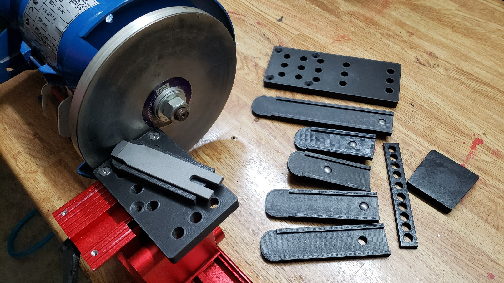

Scraper blade with 90mm radius mounted in the blade swing.  Any of the three holes in the fourth row may be used.

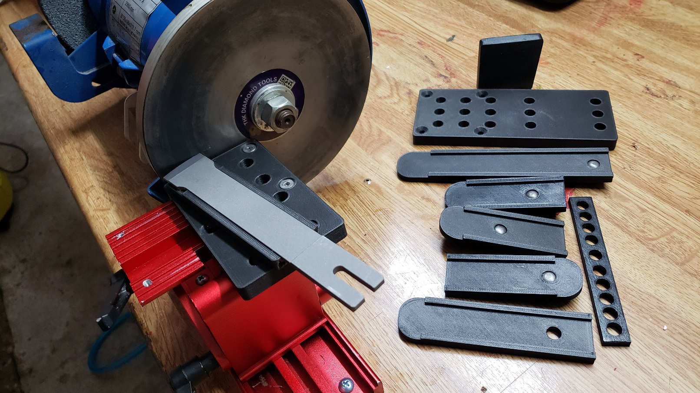

### Sharpening Jig Model

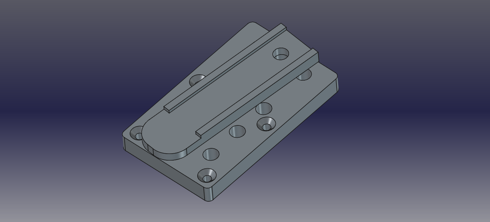

### Two Baseplates, one for a max 90mm radius, the other for 140mm radius

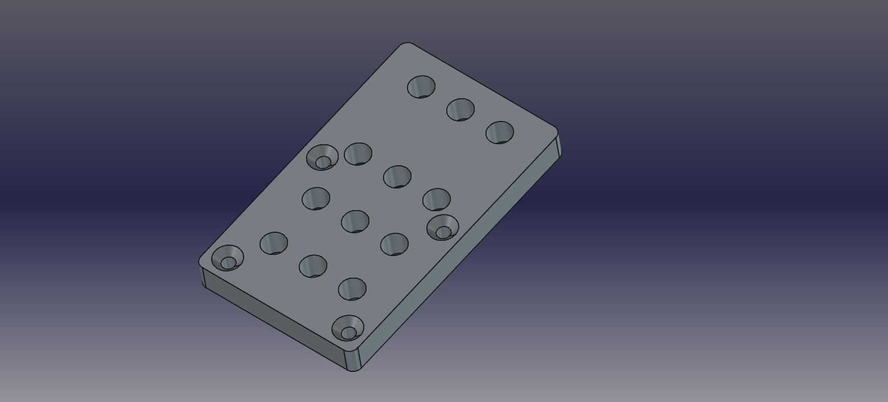

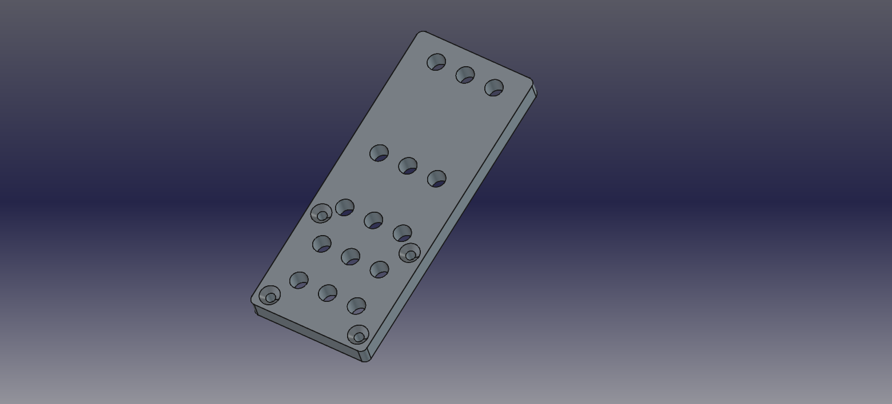

### Blade swings available for the current blade radii

Swing for 20mm radius blades
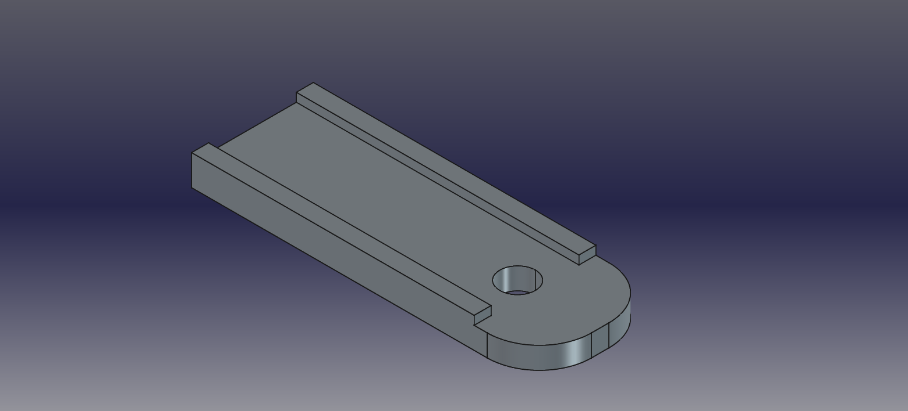

Swing for 40mm radius blades
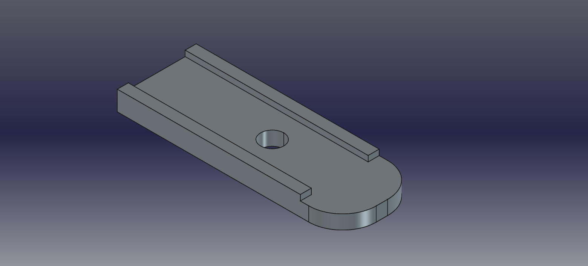

Swing for 60mm radius blades
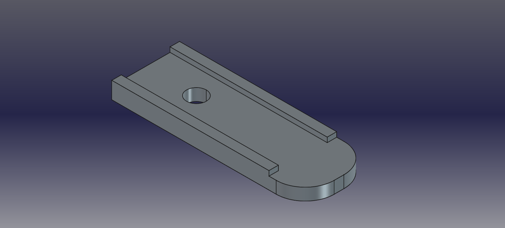

Swing for 90mm radius blades
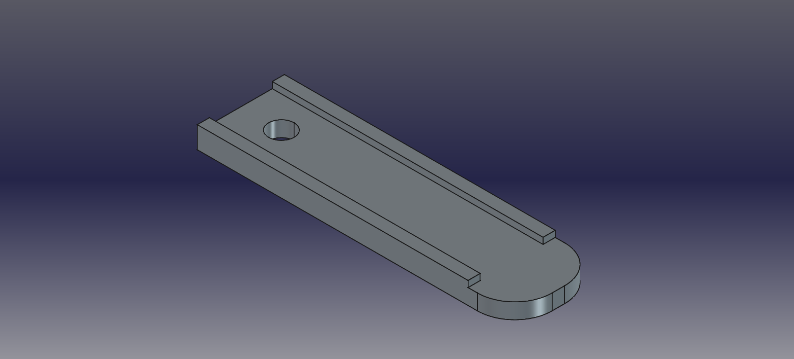

Swing for 90mm radius blades of width 25mm
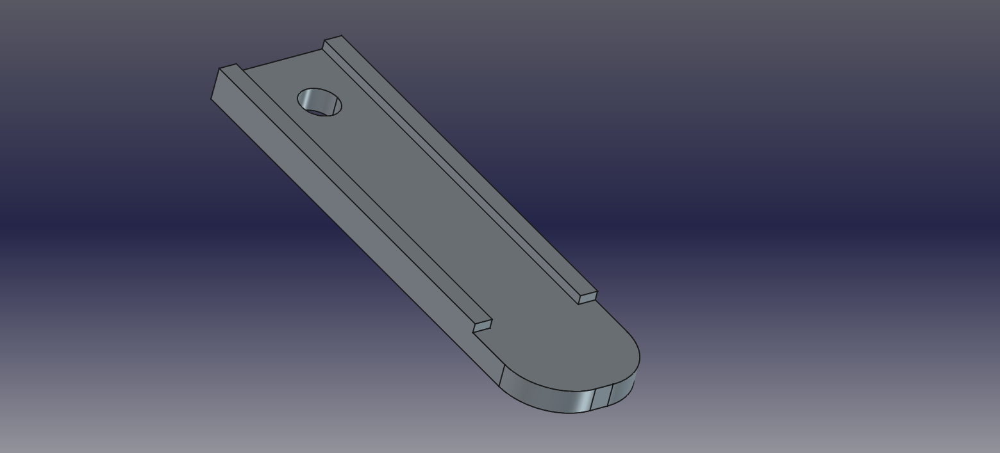

Swing for 140mm radius blades/Carbide Insert
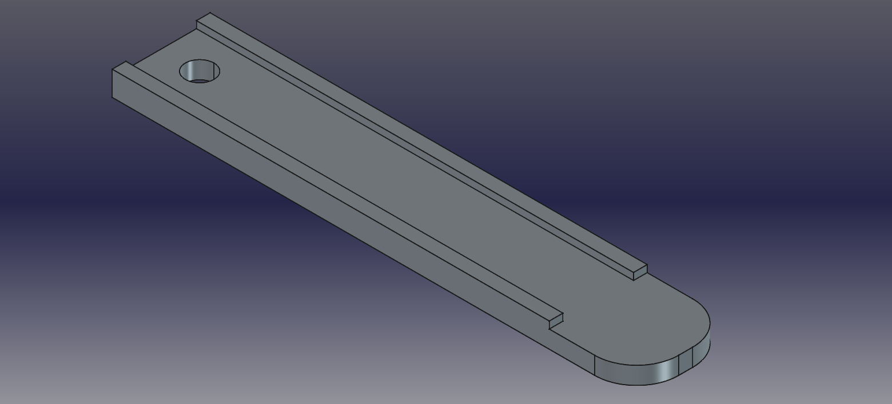

Hole size calibration strip
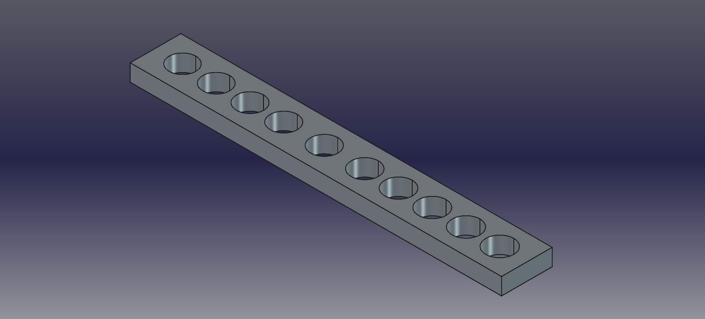

## Notes

To sharpen a blade or inserts to a radius of 140mm, use the longer base plate.

When setting up the base plate with sqing to the correct angle, use the guage block to set the angle and make sure there is a gap of 1mm beterrn the diamond wheel and the front of the swing to ensure a correct radius is set.

The current guage block sets a rake of -5 degrees for scraping cast iron.  Different materials require other rake angles.

## Version

**ScraperSharpeningJig_v1**
